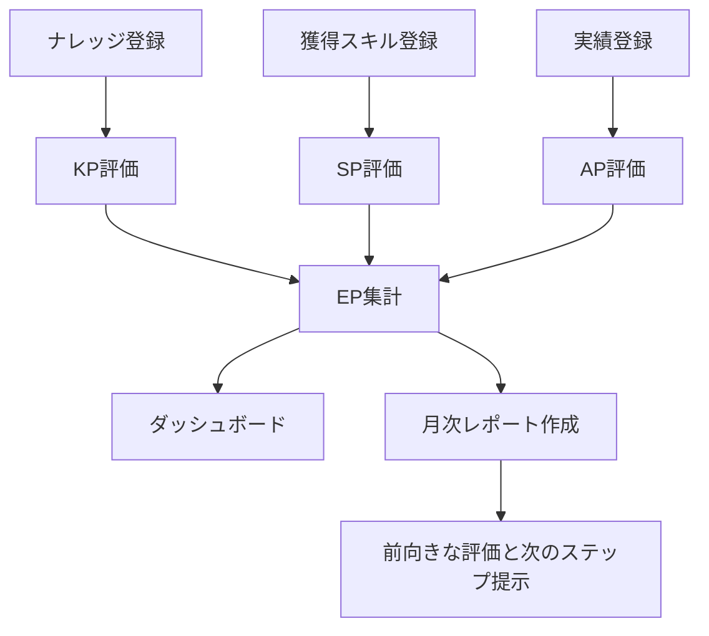

# Safety Quest 要件定義書

## 1. アプリケーション名

Safety Quest

## 2. 目的

日々の経験、気づき、身についたスキル、達成した実績を記録し、AI評価によってポイント化する。利用者はナレッジ、スキル、実績を継続的に蓄積し、エンジニア力の伸びをダッシュボードと月次レポートで確認できる。

## 3. 基本方針

- 経験を責める材料ではなく、成長を見える化する材料として扱う。
- ナレッジ、スキル、実績をそれぞれ別の登録単位として扱う。
- 登録操作は簡潔にし、主要画面はPCとスマートフォンで利用できるようにする。
- AI評価は点数とコメントを返すが、最終的な意味づけは利用者が判断できるものとする。
- レポートは前向きな文体で、できたことを認め、次のステップを提案する。
- 顧客名、APIキー、秘密鍵などの機密情報は登録前に利用者が確認する。

## 4. 対象利用者

日々の業務経験を振り返り、ナレッジ、スキル、実績として蓄積し、自分の成長を定量・定性の両面で確認したいITエンジニアを主対象とする。

## 5. 現行MVP対象

- ログイン
- ダッシュボード
- ナレッジ登録
- AI整理メモ
- 獲得スキル登録
- 実績登録
- 登録一覧検索
- 月次レポート作成、保存、表示
- KP、SP、AP、EPの表示
- エンジニア力推移グラフ
- 設定画面
- Prisma schemaによるDB構造定義

## 6. 現行MVP対象外

- 本番認証連携
- 実AI API連携
- PostgreSQLへの実CRUD接続
- メール通知の実送信
- 添付ファイル、音声入力
- チーム利用、権限管理、ランキング
- CSV/Markdown出力

## 7. 業務フロー

## 8. 機能要件

### REQ-01 ログイン

利用者はメールアドレスでログインできる。MVPではデモログインとして扱う。

### REQ-02 ダッシュボード

利用者は今月のナレッジ数、累計ナレッジ数、今月のエンジニア力向上、全体的なエンジニア力、ナレッジ登録数の推移、エンジニア力の推移、AI評価コメントを確認できる。

### REQ-03 ナレッジ登録

利用者は発生日時、影響の有無、ステータス、ナレッジの対象、気づき・学びの内容、任意詳細、機密情報確認を登録できる。登録時はAI分析を実行せず、ナレッジポイントを評価して保存する。

### REQ-04 ナレッジポイント評価

登録内容をもとにKPを評価する。評価観点は、具体性、発見契機、原因認識、次に活かせる語彙、リスク目安とする。評価結果としてKPとAI判定理由を保存する。

### REQ-05 AI整理メモ

ナレッジ登録画面の右側に、入力中の内容をもとにしたAI整理メモを表示する。「下書きを反映」ボタンで会話内容をクリアできる。

### REQ-06 獲得スキル登録

利用者は年月と身についたスキルを登録できる。登録時はAI評価によりSPと判定理由を保存する。

### REQ-07 実績登録

利用者は年月と達成した実績を登録できる。登録時はAI評価によりAPと判定理由を保存する。

### REQ-08 登録一覧検索

利用者は登録一覧でキーワード、種別、ナレッジ状態を指定して検索できる。検索結果の先頭には種別を表示し、右端には種別に対応するポイントのみ表示する。

| 種別 | 表示ポイント |
|---|---|
| ナレッジ | KP |
| スキル | SP |
| 実績 | AP |

### REQ-09 月次レポート

利用者は月次レポートを作成できる。レポートは選択した月のナレッジ、スキル、実績を確認し、月次評価、エンジニア力評価、前向きな評価コメント、次のステップ提案、KP/SP/APの内訳を表示する。

### REQ-10 設定

利用者はタイムゾーン、月次レポート通知予定、デモデータ初期化を確認・操作できる。

## 9. 非機能要件

| 分類 | 要件 |
|---|---|
| 性能 | 通常画面は2秒以内の表示を目標とする |
| 可用性 | 実AIやDB未接続でもMVP操作を確認できる |
| セキュリティ | 認証、所有権確認、入力検証、機密情報確認を前提に設計する |
| プライバシー | AI評価対象へ秘密情報を含めない運用とする |
| 保守性 | ソースは `src` 配下、DB定義は `prisma` 配下、設計書は `doc` 配下に整理する |
| アクセシビリティ | キーボード操作とテキストによる意味表示を行う |

## 10. 受け入れ条件

- ナレッジを登録するとKPと判定理由が保存される。
- 獲得スキルを登録するとSPと判定理由が保存される。
- 実績を登録するとAPと判定理由が保存される。
- ダッシュボードでナレッジ数、EP、推移、評価コメントを確認できる。
- 一覧でナレッジ、スキル、実績を種別指定して検索できる。
- 一覧右端には種別に対応するポイントだけが表示される。
- 月次レポートはナレッジ、スキル、実績を確認して、前向きな評価と次のステップを表示する。
- 月次レポートは同じ月に対して1件として保存される。
- Prisma schemaが検証に成功する。

## 11. 現行MVPの保存方式

画面実装はブラウザの `localStorage` に保存している。DB移行用の正式構造は `prisma/schema.prisma` と `doc/05_current_database_design.md` に定義する。
