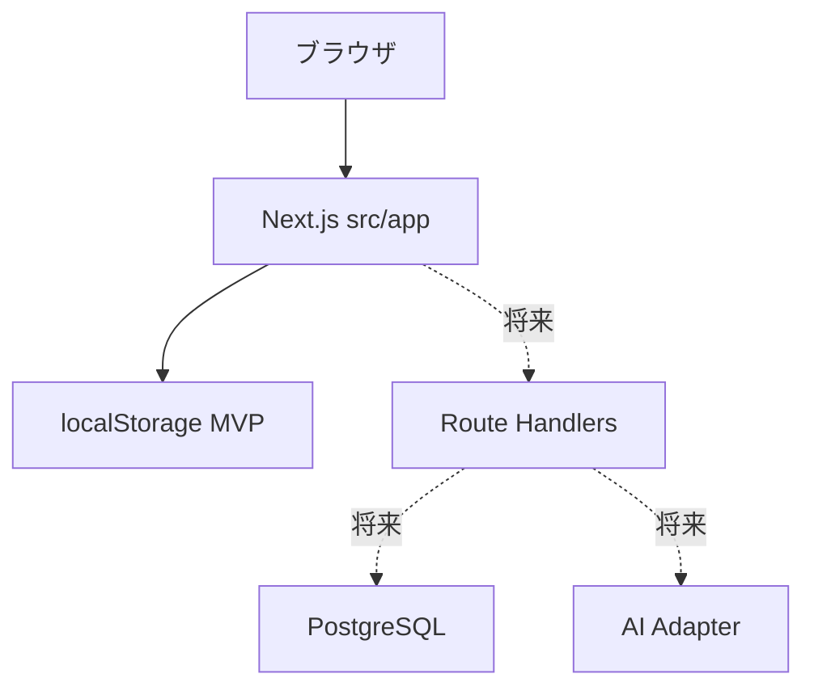
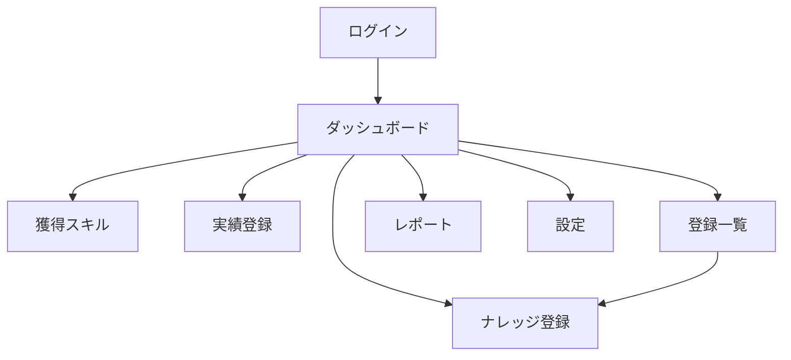

# Safety Quest 基本設計書

## 1. 設計方針

本書は、現行MVPの画面構成、機能配置、データ構造、DB移行方針を定義する。現在のアプリは、ナレッジ、獲得スキル、実績を登録し、AI評価風ロジックでKP/SP/APを算出して、エンジニア力として可視化する。

## 2. システム構成

| 層 | 現行構成 | 将来構成 |
|---|---|---|
| Web | Next.js App Router | 継続 |
| 言語 | TypeScript | 継続 |
| UI | グローバルCSS | 必要に応じてコンポーネント分割 |
| 状態保存 | `localStorage` | PostgreSQL |
| ORM | Prisma schema定義済み | Prisma Client |
| AI | 疑似AIルール | AI Adapter経由の実API |
| 認証 | デモログイン | Auth.js等 |



## 3. フォルダ構成

```text
safety-quest/
  src/
    app/
      layout.tsx
      page.tsx
      globals.css
  prisma/
    schema.prisma
  doc/
    01_requirements_specification.md
    02_basic_design.md
    03_detailed_design.md
    04_test_specification.md
    05_current_database_design.md
  gui_mock/
    *.html
  package.json
  tsconfig.json
  next.config.ts
```

`node_modules` と `.next` は依存物・生成物であり、`src` 配下には置かない。

## 4. モジュール構成

| モジュール | 責務 | 現行実装 |
|---|---|---|
| Auth | デモログイン | `src/app/page.tsx` |
| Dashboard | 件数、EP、推移、評価コメント表示 | `DashboardView` |
| Knowledge | ナレッジ登録、KP判定 | `CreateView`, `judgeKnowledgePoints` |
| AI Memo | 入力中ナレッジの整理メモ | `sendDraftMessage`, `buildDraftCoachReply` |
| Skill | 獲得スキル登録、SP判定 | `QuestView`, `judgeSkillPoints` |
| Achievement | 実績登録、AP判定 | `AchievementView`, `judgeAchievementPoints` |
| List | 種別横断検索 | `ListView`, `buildSearchListItems` |
| Report | 月次レポート作成・保存・表示 | `ReportView`, `buildAiReport` |
| Settings | タイムゾーン、月次通知表示、初期化 | `SettingsView` |
| DB Schema | PostgreSQL移行用DB定義 | `prisma/schema.prisma` |

## 5. 画面設計

| ID | 画面 | 主な内容 |
|---|---|---|
| SCR-01 | ログイン | デモログイン |
| SCR-02 | ダッシュボード | ナレッジ数、EP、推移グラフ、AI評価コメント |
| SCR-03 | ナレッジ登録 | ナレッジ入力、KP評価、AI整理メモ |
| SCR-04 | 獲得スキル | 年月、スキル本文、SP評価登録 |
| SCR-05 | 実績登録 | 年月、実績本文、AP評価登録 |
| SCR-06 | 登録一覧 | ナレッジ、スキル、実績の検索 |
| SCR-07 | レポート | 月次レポート作成、年月選択、評価表示 |
| SCR-08 | 設定 | タイムゾーン、月次通知、デモデータ初期化 |

## 6. 画面遷移



一覧でナレッジを選択した場合は、登録済み内容を反映したナレッジ登録画面へ遷移する。スキルと実績は一覧で参照のみとする。

## 7. データ設計概要

| エンティティ | 概要 |
|---|---|
| User | 利用者、合計EP、設定 |
| KnowledgeEntry | ナレッジ本文、KP、ステータス、リスク目安 |
| AcquiredSkill | スキル本文、SP、判定理由、年月 |
| AchievementRecord | 実績本文、AP、判定理由、年月 |
| MonthlyReport | 月次評価、エンジニア力評価、対象年月 |
| PointEvent | KP/SP/APの加算履歴 |

詳細は `doc/05_current_database_design.md` と `prisma/schema.prisma` を参照する。

## 8. AI評価設計

現行MVPでは実AI APIを呼び出さず、疑似AIルールで評価する。

| 対象 | 点数 | 主な観点 |
|---|---|---|
| ナレッジ | KP | 具体性、発見契機、原因認識、再利用性、リスク目安 |
| スキル | SP | 自動化、検証、設計、レビュー、手順化 |
| 実績 | AP | 成果の大きさ、標準化、改善、支援、削減 |
| 月次レポート | コメント | ナレッジ、スキル、実績の件数とKP/SP/AP内訳 |

レポートコメントは前向きな文体とし、できたことを認めたうえで次のステップを提案する。

## 9. API設計方針

現行MVPではAPI未実装。DB接続移行時は次のAPIを想定する。

| Method | Path | 概要 |
|---|---|---|
| POST | `/api/knowledge` | ナレッジ登録、KP保存 |
| GET | `/api/entries` | ナレッジ、スキル、実績の横断検索 |
| POST | `/api/skills` | 獲得スキル登録、SP保存 |
| POST | `/api/achievements` | 実績登録、AP保存 |
| GET | `/api/dashboard` | ダッシュボード集計 |
| GET | `/api/reports` | 月次レポート一覧 |
| POST | `/api/reports/generate` | 月次レポート作成 |
| GET/PATCH | `/api/settings` | 設定取得・更新 |

## 10. 移行方針

1. Prisma schemaを維持する。
2. PostgreSQLを用意する。
3. `prisma migrate dev` でDBを作成する。
4. Route Handlersを追加する。
5. `localStorage` 操作をAPI呼び出しへ置き換える。
6. 実AI Adapterを追加する。
